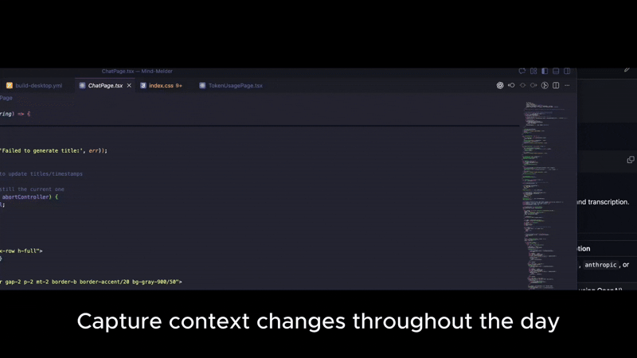
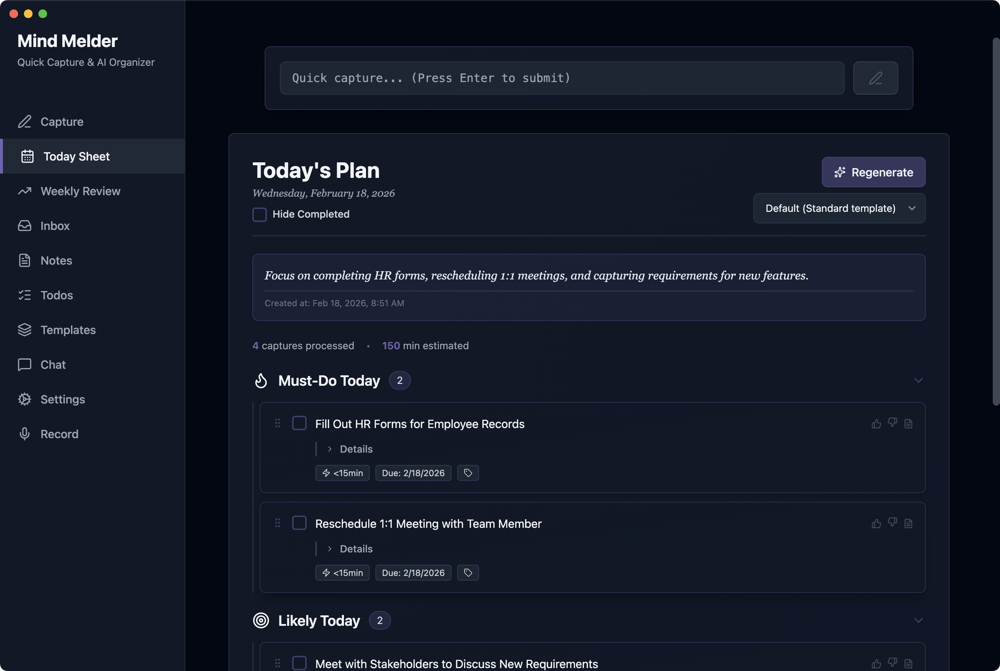
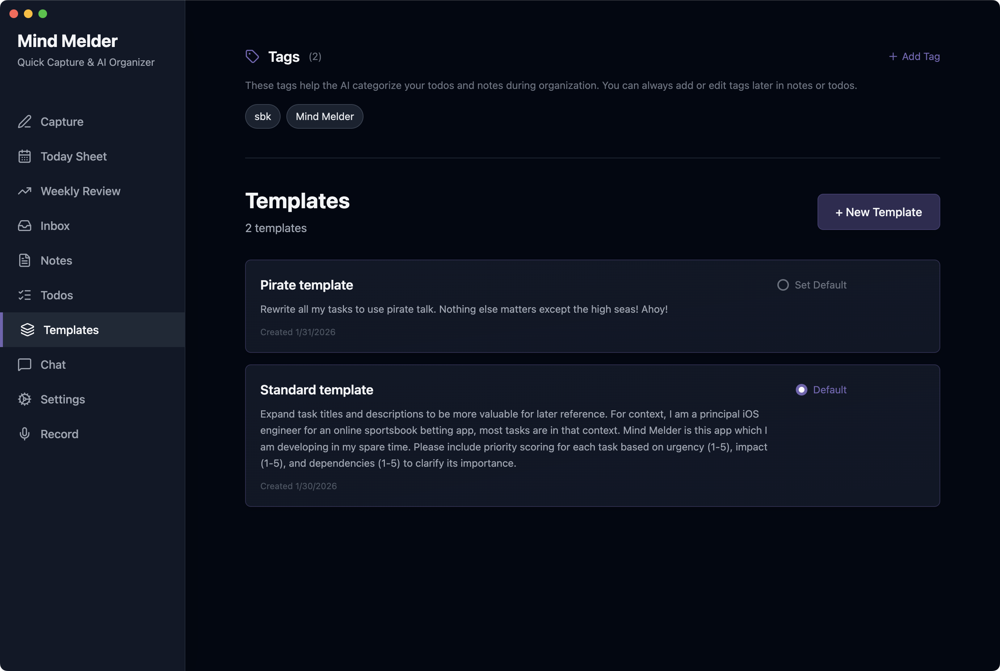
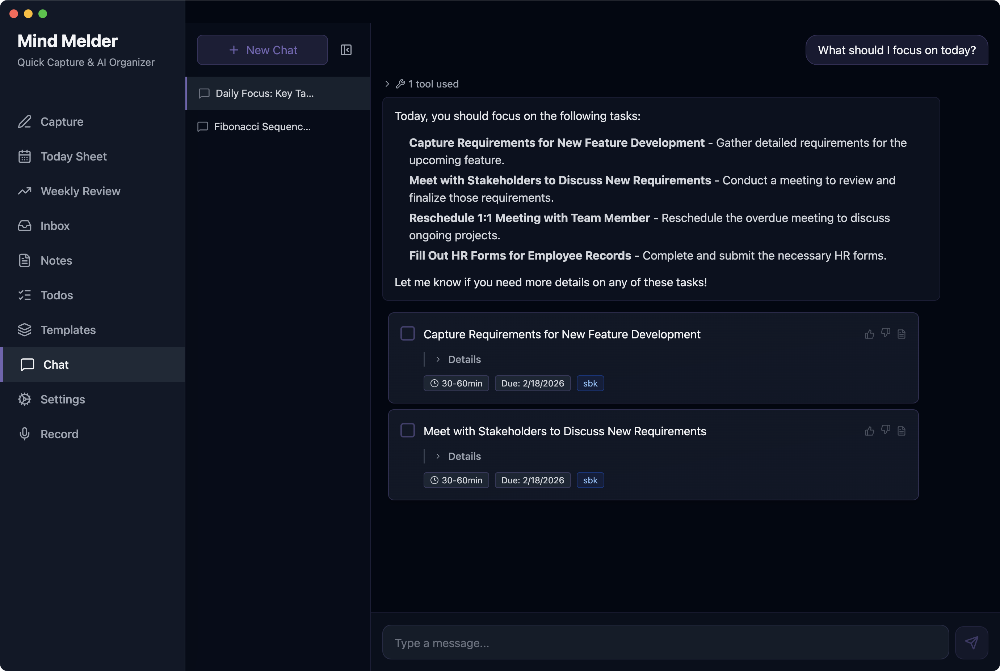
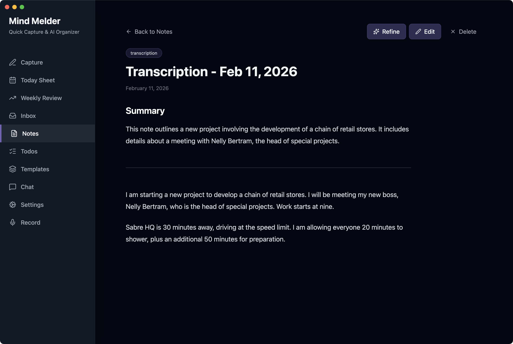

# Mind-Melder

[](https://github.com/SlayterDev/Mind-Melder/actions/workflows/ci.yml) [](https://buymeacoffee.com/slayterdev)

A self-hosted productivity tool that captures quick notes throughout the day and uses LLM summarization to organize them into structured notes and actionable todo lists.



## Key Features

- Quick capture with keyboard shortcut (Cmd/Ctrl+Shift+C)
- LLM-powered organization (OpenAI, Anthropic, Ollama)
- Today Sheet — AI-generated daily prioritized plan
- Full-text search across captures, notes, and todos
- Global tag management for AI-guided categorization
- User-defined templates for personalized structure
- Feedback system for AI-generated todos
- Record and transcribe system audio (OpenAI or local whisper)
- Desktop app via Electron (macOS, Windows, Linux)
- Self-hosted via Docker Compose

|   Today Sheet - Structured Daily Plan |  Customize AI prompts with templates|
| -- | -- |
|  Chat using your todos and notes |  Transcribe and summarizr audio |

## Quick Start

### 1. Download the compose file

```bash
curl -O https://raw.githubusercontent.com/SlayterDev/Mind-Melder/main/docker-compose.prod.yml
```

### 2. Create a `.env` file

```env
# Required — add an API key for at least one AI provider (or use Ollama)
OPENAI_API_KEY=sk-...

# Optional overrides (defaults shown)
# POSTGRES_PASSWORD=postgres
# API_PORT=3000
# WEB_PORT=8080
# TZ=America/Chicago
# ORGANIZATION_SCHEDULE=0 17 * * *
```

### 3. Start the stack

```bash
docker compose -f docker-compose.prod.yml up -d
```

The UI is available at `http://localhost:8080`. Set your LLM provider in settings based on the keys you setup in your `.env` file.

Download the native app from [releases](https://github.com/SlayterDev/Mind-Melder/releases) for hotkey quick capture and system audio recording and transcription.

## Configuration

| Variable | Default | Description |
|---|---|---|
| `OPENAI_API_KEY` | — | OpenAI API key (when using OpenAI) |
| `ANTHROPIC_API_KEY` | — | Anthropic API key (when using Anthropic) |
| `OLLAMA_BASE_URL` | `http://host.docker.internal:11434` | Ollama server URL (when using Ollama) |
| `POSTGRES_USER` | `postgres` | PostgreSQL username |
| `POSTGRES_PASSWORD` | `postgres` | PostgreSQL password |
| `POSTGRES_DB` | `capture` | PostgreSQL database name |
| `API_PORT` | `3000` | Host port for the API |
| `WEB_PORT` | `8080` | Host port for the web UI |
| `TZ` | `America/Chicago` | Timezone for scheduling |
| `ORGANIZATION_SCHEDULE` | `0 17 * * *` | Cron schedule for auto-organization |

See [LLM_SETUP.md](./docs/LLM_SETUP.md) for detailed LLM provider configuration.

See [LOCAL_WHISPER_SETUP.md](./docs/LOCAL_WHISPER_SETUP.md) for transcribing recordings locally.

## Usage Flow

1. **Capture** — Hit keyboard shortcut anywhere (`cmd+shift+C`), type a note, press Enter
2. **Today Sheet** — Generate an AI-powered daily plan from captures and todos
3. **Search** — Full-text search across all captures, notes, and todos
4. **Chat** - Chat with your LLM about your todos and notes
5. **Review** — Check Organized Notes and Todo List with tags
6. **Complete** — Check off todos as you finish them

## Building from Source

If you prefer to build images locally instead of pulling from GHCR:

```bash
git clone https://github.com/SlayterDev/Mind-Melder.git
cd Mind-Melder
cp .env.example .env
# Edit .env with your LLM provider key(s)

docker compose build
docker compose up -d
```

## Contributing

See [docs/DEVELOPMENT.md](./docs/DEVELOPMENT.md) for development setup and commands.

This project follows strict scope boundaries defined in [PROJECT_SPEC.md](./docs/PROJECT_SPEC.md). Before adding features, verify the feature exists in the spec and is within the current milestone.

## Documentation

- [DEVELOPMENT.md](./docs/DEVELOPMENT.md) — Development setup and commands
- [LLM_SETUP.md](./docs/LLM_SETUP.md) — LLM provider configuration
- [TECH_STACK.md](./docs/TECH_STACK.md) — Technology choices
- [TODAY_SHEET.md](./docs/TODAY_SHEET.md) — AI daily planning feature
- [ELECTRON_DESKTOP.md](./docs/ELECTRON_DESKTOP.md) — Desktop app
- [PROJECT_SPEC.md](./docs/PROJECT_SPEC.md) — Feature specification

## License

Licensed under the [Apache 2.0](./LICENSE) License.
