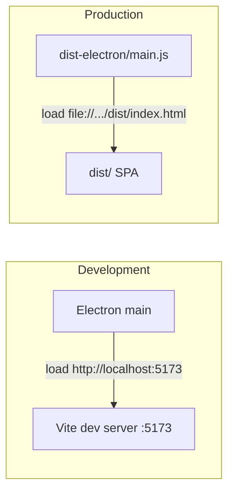

# Wrap React app as Electron desktop app

Plan: Add Electron as a desktop shell around the existing Vite + React app in `apps/web`, with a main process that loads the app (dev server in development, built files in production), optional packaging via electron-builder, and a system hotkey for quick capture.

---

## Current state

- **Web app**: [apps/web](apps/web) — Vite 5 + React 18, builds to `dist/`, uses `VITE_API_URL` (default `http://localhost:3000/api/v1`) in [apps/web/src/api/client.ts](apps/web/src/api/client.ts).
- **API**: Separate Express server (port 3000); desktop app will continue to talk to it via the same env (user runs API separately or points `VITE_API_URL` at a remote host).

## Approach: Electron inside `apps/web`

Keep a single app: add Electron main + preload under `apps/web`, and run/build the existing Vite app as the renderer. No new workspace package; scripts and packaging live in the web app.

**Alternative (not recommended here):** a separate `apps/desktop` package that depends on `web` and only contains the Electron shell — cleaner separation but extra build coordination and two places to run "desktop".

---

## 1. Electron process files in `apps/web`

**`apps/web/electron/main.ts`** (Node/CommonJS or ESM with appropriate config)

- Create `BrowserWindow` with `webPreferences`: `contextIsolation: true`, `nodeIntegration: false`, `preload: path.join(__dirname, 'preload.js')` (or equivalent for ESM).
- **Dev**: `process.env.NODE_ENV !== 'production'` → load `http://localhost:5173` (Vite dev server). Document or script that user must start Vite first, or use `concurrently` / a small script to start both.
- **Prod**: load `file://${path.join(__dirname, '../dist/index.html')}` (or use a custom protocol like `app://` if you prefer).
- Handle window close (e.g. `app.quit()` on macOS if it's the only window).
- Optional: set `title` and default `width`/`height`.
- Register a **global shortcut** and create/show a **quick-capture popup** window (see §8).

**`apps/web/electron/preload.ts`**

- Minimal preload: use `contextBridge` to expose a small API (e.g. `window.electron.openExternal(url)`) for opening links in the system browser; no Node in renderer.
- Build preload to `dist-electron/preload.js` (or `electron/preload.js`) via a separate tsconfig/script or Vite build so Electron's `__dirname` can resolve it.

**Build output for Electron**

- Main process: compile `electron/main.ts` to a single file (e.g. `dist-electron/main.js`) with tsconfig targeting Node and a script like `tsc -p electron/tsconfig.json` or a small esbuild script.
- Preload: same idea — build to `dist-electron/preload.js`. Both must be on disk so `__dirname` works when loading.

---

## 2. Vite config for file protocol (production)

In [apps/web/vite.config.ts](apps/web/vite.config.ts), set `base: './'` so assets and the entry point resolve correctly when the window loads `file://.../dist/index.html`. If you ever switch to a custom protocol, you can change this.

---

## 3. `apps/web/package.json` changes

- **main**: `"main": "dist-electron/main.js"` (or wherever the compiled main lives).
- **scripts** (examples):
  - `"electron:dev"`: start Vite dev server in background, then run Electron (e.g. `concurrently "vite" "wait-on http://localhost:5173 && electron ."` or a small Node script that spawns both).
  - `"electron:build"`: run `vite build` then compile Electron sources to `dist-electron`, so the packaged app has `dist/` + `dist-electron/`.
  - `"electron:pack"` / `"electron:dist"`: run `electron-builder` (or electron-forge) to produce installers.
- **devDependencies**: `electron`, `electron-builder` (or `@electron-forge/cli`), and a way to compile TS for Node (e.g. `tsc` or `esbuild`). Optional: `concurrently`, `wait-on` for dev UX.

---

## 4. electron-builder (or Forge) config

- **Directories**: `app` (or equivalent) points at `apps/web`; **files** include `dist/**`, `dist-electron/**`, and exclude dev-only files.
- **ExtraResources** / **asar**: package `dist` and `dist-electron` so the main process path (e.g. `dist-electron/main.js`) is correct when packaged.
- **Platforms**: at least macOS (dmg) and optionally Windows (nsis) / Linux.

Put config in `apps/web/electron-builder.json5` (or `package.json` `"build"` key).

---

## 5. API URL for desktop

- No code change required: the renderer already uses `VITE_API_URL` from [apps/web/src/api/client.ts](apps/web/src/api/client.ts). For the packaged app, either:
  - Build with `VITE_API_URL=https://your-api.example.com/api/v1` for a fixed remote API, or
  - Leave default `http://localhost:3000/api/v1` and document that the user must run the API locally (or use env at build time / a settings screen later).

---

## 6. Root monorepo scripts (optional)

In root [package.json](package.json), add e.g. `"desktop:dev": "pnpm --filter web electron:dev"` and `"desktop:build": "pnpm --filter web electron:build"` so you can run desktop from the repo root.

---

## 7. Security checklist

- `contextIsolation: true`, `nodeIntegration: false` in `BrowserWindow`.
- Preload only exposes the minimal API needed (e.g. `openExternal`).
- No `nodeIntegrationInSubframes` or `webSecurity: false` unless you have a very good reason.

---

## 8. System hotkey: quick capture popup (or focus main window)

Electron supports this via the built-in `globalShortcut` API so the hotkey works even when the app is in the background or minimized.

**Preferred: small quick-capture popup**

- In the main process, register a global shortcut (e.g. `CommandOrControl+Shift+C`) with `globalShortcut.register()` after `app.whenReady()`.
- When the shortcut fires, create a **second BrowserWindow**: small, frameless (or thin chrome), always-on-top, centered. Load either:
  - A dedicated quick-capture HTML route from your app (e.g. `#/quick-capture` or a minimal `quick-capture.html` that mounts a tiny React component), or
  - A minimal static HTML + script that posts to your API and then closes (no React needed for this window).
- Reuse the existing [QuickCaptureInput](apps/web/src/components/QuickCaptureInput.tsx) behavior: on submit, POST to `/api/v1/captures`, then close the popup. Expose `window.electron.submitCapture(content)` from preload so the popup can call the API (or let the popup use `fetch` with `VITE_API_URL` if it loads from the same origin).
- Register shortcuts in `app.whenReady()` and unregister in `app.on('will-quit')` to avoid conflicts.

**Alternate: focus main window**

- In the same global shortcut handler, if you prefer not to show a popup: call `mainWindow.show()` and `mainWindow.focus()`. You could make this configurable (e.g. env or a settings flag: "hotkey opens popup" vs "hotkey focuses main window").

**Implementation notes**

- **Quick-capture window**: Same security as main window (`contextIsolation`, `nodeIntegration: false`, preload if it needs to talk to main process). If the popup loads a route from your SPA, it will need the same API base URL; if it's a tiny standalone page, it can use `fetch(VITE_API_URL + '/captures', ...)` with the env var.
- **Preload for popup**: Expose e.g. `submitCapture(text)` and/or `closeQuickCapture()` via contextBridge so the popup can submit and close without Node in the renderer.
- **Single instance**: Reuse one quick-capture window: create on first hotkey, hide on close; show/focus on subsequent hotkeys instead of creating a new window.

---

## High-level flow

---

## File summary

| Action   | Path                                                                  |
| -------- | --------------------------------------------------------------------- |
| Add      | `apps/web/electron/main.ts`                                           |
| Add      | `apps/web/electron/preload.ts`                                        |
| Add      | `apps/web/electron/tsconfig.json` (or shared tsconfig for Node build) |
| Add      | `apps/web/electron-builder.json5` (or config in package.json)         |
| Modify   | `apps/web/vite.config.ts` — set `base: './'`                          |
| Modify   | `apps/web/package.json` — main, scripts, devDependencies               |
| Optional | Root `package.json` — desktop:* scripts                               |
| For §8   | Main process: `globalShortcut` + create/show quick-capture window; preload: expose `submitCapture` / `closeQuickCapture`; optional: minimal `quick-capture.html` or SPA route for popup UI |

No changes to React components or API client unless you later add a "desktop" settings screen or inject API URL via preload. For the quick-capture popup you can reuse [QuickCaptureInput](apps/web/src/components/QuickCaptureInput.tsx) in a small window or a minimal standalone form.
