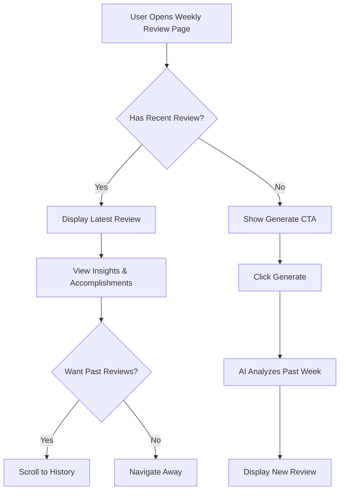

# Weekly Review & Insights

## Overview

The Weekly Review feature provides AI-powered analysis of a user's productivity patterns over the past week. It automatically analyzes captures, notes, and todos to generate insights, celebrate accomplishments, and suggest focus areas for improvement.

## Purpose

Weekly reflection is a proven productivity practice, but it's time-consuming and often skipped. This feature automates the review process while still providing valuable insights that help users:

1. **Celebrate wins** - Recognize completed tasks and progress
2. **Identify patterns** - Understand what gets done vs. what doesn't
3. **Improve planning** - Learn from the past week to plan better
4. **Maintain momentum** - Regular reflection prevents stagnation

## User Experience

### Generating a Review

Users can generate a weekly review in two ways:

1. **Manual**: Click "Generate Weekly Review" button on the Weekly Review page
2. **Scheduled**: Optional weekly notification reminder (Electron only)

The AI analyzes the past 7 days of activity including:
- Completed and pending todos
- Captures (organized and unorganized)
- Notes created
- Today Sheet patterns

### Review Content

Each weekly review includes:

1. **Week Summary** - High-level overview of the week (2-3 sentences)
2. **Accomplishments** - Key completed tasks and goals achieved
3. **Patterns & Insights** - Behavioral observations:
   - What types of tasks get completed vs. delayed
   - Time allocation across different areas
   - Common blockers or challenges
4. **Carry Forward Items** - Unfinished tasks that should continue
5. **Recommendations** - Suggested focus areas for next week

### Review History

- Reviews are stored as timestamped records
- Users can view past reviews to track long-term progress
- Each review is immutable once generated

## Technical Design

### Database Schema

```typescript
// weekly_reviews table
{
  id: uuid (PK)
  user_id: string
  week_start_date: date        // Monday of the review week (ISO format)
  week_end_date: date          // Sunday of the review week
  summary: text                // High-level week summary
  insights: jsonb              // Structured insights data
  created_at: timestamp
}

// insights structure
{
  accomplishments: string[],
  patterns: {
    completionRate: number,      // % of todos completed
    topCategories: string[],     // Most active tag categories
    observations: string[]       // AI-generated observations
  },
  carryForward: {
    todoId: string,
    content: string,
    reason: string               // Why it wasn't completed
  }[],
  recommendations: string[]
}
```

### API Endpoints

**POST /api/v1/weekly-review/generate**
- Generates a new weekly review for the current week
- Query params: `weekStartDate` (optional, defaults to most recent Monday)
- Returns: Weekly review object

**GET /api/v1/weekly-review/latest**
- Returns the most recent weekly review
- Returns 404 if no reviews exist

**GET /api/v1/weekly-review**
- Lists all weekly reviews, most recent first
- Pagination: `page`, `perPage` query params
- Returns: Array of weekly review objects

**GET /api/v1/weekly-review/:id**
- Gets a specific weekly review by ID
- Returns: Weekly review object

### LLM Integration

Add `generateWeeklyReview()` method to `LLMProvider` interface:

```typescript
interface WeeklyReviewInput {
  weekStartDate: Date;
  weekEndDate: Date;
  completedTodos: Todo[];
  pendingTodos: Todo[];
  captures: Capture[];
  notes: OrganizedNote[];
  todaySheets: TodaySheet[];
}

interface WeeklyReviewOutput {
  summary: string;
  insights: {
    accomplishments: string[];
    patterns: {
      completionRate: number;
      topCategories: string[];
      observations: string[];
    };
    carryForward: Array<{
      todoId: string;
      content: string;
      reason: string;
    }>;
    recommendations: string[];
  };
}
```

The LLM prompt will:
1. Analyze todo completion patterns
2. Identify most productive areas (by tags/categories)
3. Recognize blockers and delays
4. Generate actionable recommendations
5. Maintain encouraging tone while being honest about areas for improvement

### Frontend Components

**WeeklyReviewPage** (`apps/web/src/pages/WeeklyReviewPage.tsx`)
- Main page showing latest review or "Generate" CTA
- Tabs or sections for different insight categories
- Button to generate new review
- List of past reviews (expandable/collapsible)

**WeeklyReviewCard** (component)
- Displays a single review's insights
- Formatted markdown rendering for insights
- Date range display
- Visual indicators (charts/badges for completion rate, etc.)

### Electron Integration

**Weekly Notification** (optional)
- OS notification on Sunday evening or Monday morning
- Message: "Ready for your weekly review?"
- Click opens app to Weekly Review page
- Configurable in Settings (enable/disable, day/time)

**Menu Item**
- Add "Generate Weekly Review" to app menu
- Keyboard shortcut: Cmd/Ctrl+Shift+W

## User Flow



## Implementation Notes

### Scope Boundaries

**In Scope:**
- Basic weekly review generation with AI insights
- Review history viewing
- Manual generation trigger
- Integration with existing data (todos, captures, notes)

**Out of Scope (Future):**
- Multi-week trend analysis
- Exportable reports (PDF/etc.)
- Comparison between weeks
- Custom review templates
- Goal tracking integration

### Performance Considerations

- Reviews are generated on-demand (not automatically scheduled)
- Cache the current week's review to avoid re-generation
- Limit LLM context to relevant data (last 7 days only)
- Paginate review history to avoid loading all reviews

### Privacy & Security

- Reviews contain personal productivity data
- Stored locally in user's database
- No external sharing or analytics
- User can delete old reviews (future enhancement)

## Success Metrics

The feature is successful if:
1. Users generate reviews regularly (weekly or bi-weekly)
2. Insights are actionable and accurate
3. Recommendations are followed (measured by todo patterns changing)
4. Users report value in retrospectives/feedback

## Future Enhancements

- **Trend tracking**: Compare completion rates week-over-week
- **Goal setting**: Set weekly goals and track achievement
- **Custom prompts**: User-defined review templates
- **Export**: Generate PDF or Markdown reports
- **Sharing**: Optional sharing of anonymized insights
- **Integration**: Connect reviews with Today Sheet generation
